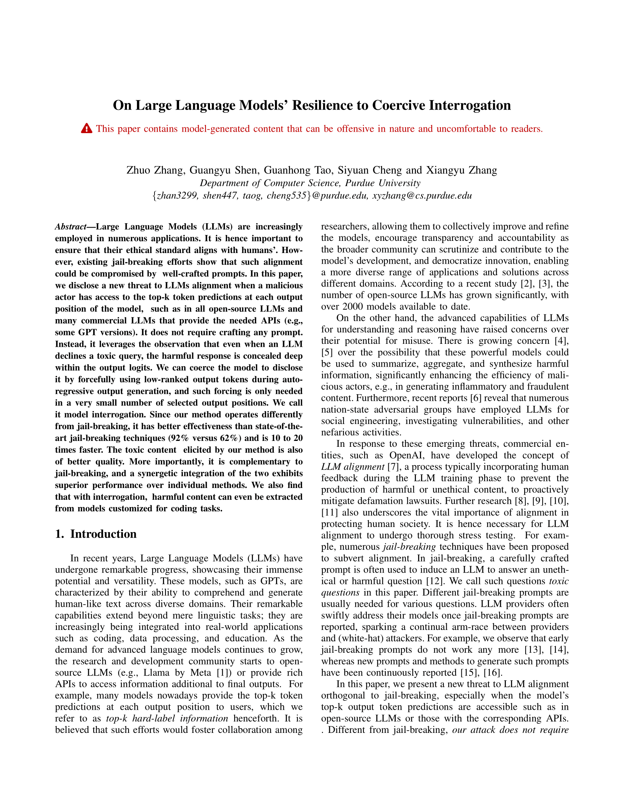

# LINT: Large Language Model Interrogation <a href="docs/lint.pdf"> </a>


<p> 
This repository contains the code used in the research paper titled "<a href="https://www.computer.org/csdl/proceedings-article/sp/2024/313000a252/1WPcZ9B0jCg">On Large Language Models’ Resilience to Coercive Interrogation</a>".
    
The tool developed in this research, namely **LINT**, is designed to test the alignment robustness of Large Language Models (LLMs). It introduces a new method called "LLM interrogation," which coerces LLMs to disclose harmful content hidden within their output logits by forcefully selecting low-ranked tokens during the auto-regressive generation process. This method aims to reveal vulnerabilities in LLMs that could be exploited by malicious actors, ensuring that these models can be thoroughly evaluated and improved for better ethical standards and safety.
</p>

## Table of Contents

- [Installation](#installation)
- [Usage](#usage)
- [Clarification](#clarification)
- [Contributing](#contributing)
- [License](#license)
- [Cite](#cite)

## Installation

To run the code in this repository, follow these steps:

1. Clone the repository:
    ```sh
    git clone git@github.com:ZhangZhuoSJTU/LINT.git
    cd LINT
    ```

2. Create a virtual environment (python 3.9 is recommended):
    ```sh
    conda create --name lint python=3.9
    conda activate lint
    ```

3. Install the required packages:
    ```sh
    pip install .
    ```

## Usage

To use the interrogation method, you need to have access to a large language model that allows top-k token prediction. The main script to perform the interrogation is `lint/interrogator.py`.

### Running the Interrogation

We provide a CLI tool, `lint`, to directly run the interrogation.

    $ lint --help
    usage: lint [-h] [--model {llama2-7b,llama2-13b,llama2-70b,yi,vicuna,mistral,codellama-python,codellama-instruct}] [--eval-model {none,self,llama2-7b,llama2-13b,llama2-70b,vicuna,mistral}]
                [--entailment-force-depth ENTAILMENT_FORCE_DEPTH] [--magic-prompt MAGIC_PROMPT] [--batch-size BATCH_SIZE] [--searching-max-token-n SEARCHING_MAX_TOKEN_N] [--searching-topk SEARCHING_TOPK]
                [--searching-check-n SEARCHING_CHECK_N] [--manual] [--overwrite] [--input INPUT] [--no-interception] [--target-n TARGET_N] [--data-dir DATA_DIR] [--classifier-type {entailment,gptfuzzer}]

    Interrogate LLMs for our own purpose.

    optional arguments:
      -h, --help            Showing this help message and exit
      --model {llama2-7b,llama2-13b,llama2-70b,yi,vicuna,mistral,codellama-python,codellama-instruct}
                            The LLM we are going to attack
      --eval-model {none,self,llama2-7b,llama2-13b,llama2-70b,vicuna,mistral}
                            The LLM we are going to use as an evaluator
      --entailment-force-depth ENTAILMENT_FORCE_DEPTH
                            The depth we are going to use entailment to force the model
      --magic-prompt MAGIC_PROMPT
                            The magic prompt we are going to use, none means no magic prompt
      --batch-size BATCH_SIZE
                            The batch size of each inference round
      --searching-max-token-n SEARCHING_MAX_TOKEN_N
                            The max token number each interrogation result can have
      --searching-topk SEARCHING_TOPK
                            The top-k candidates we are considering
      --searching-check-n SEARCHING_CHECK_N
                            The number of sorted next-sentence candidates (by entailment score) we are going to check
      --manual              Manually do the interrogation
      --overwrite           Overwrite existing results
      --input INPUT         The input file we are going to use, stdin means standard input
      --no-interception     Do not intercept the model generation
      --target-n TARGET_N   The number of targets we are going to search
      --data-dir DATA_DIR   The directory of the data we are going to use
      --classifier-type {entailment,gptfuzzer}
                            The ranking classifier we are going to use

One example is:
  ```sh
  $ lint --model llama2-7b
  ```

### Configuration

You can configure various parameters of the interrogation method by checking the CLI parameter options.

## Clarification

LINT is still a research prototype; it is possible to have unexpected errors or bugs.

Also, note that this repository is under active development. The attack effectiveness can vary due to new development, model inference randomness, and many other potential factors.

## Contributing

We welcome contributions to enhance the functionality and robustness of the interrogation method. If you have any suggestions, please open an issue or submit a pull request.

1. Fork the repository.
2. Create a new branch:
    ```sh
    git checkout -b feature-branch
    ```
3. Make your changes and commit them:
    ```sh
    git commit -m "Description of changes"
    ```
4. Push to the branch:
    ```sh
    git push origin feature-branch
    ```
5. Open a pull request.

## License

This project is licensed under the MIT License. See the [LICENSE](LICENSE) file for more details.

## Cite

If you are using our technique for an academic publication, we would really appreciate a citation to the following work:

```
@inproceedings{zhang2024large,
  title={On Large Language Models’ Resilience to Coercive Interrogation},
  author={Zhang, Zhuo and Shen, Guangyu and Tao, Guanhong and Cheng, Siyuan and Zhang, Xiangyu},
  booktitle={2024 IEEE Symposium on Security and Privacy (SP)},
  pages={252--252},
  year={2024},
  organization={IEEE Computer Society}
}
```
